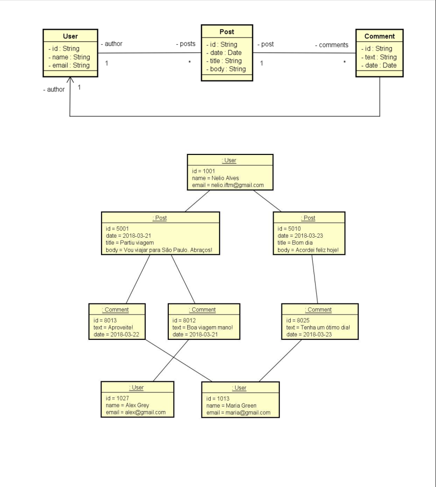

# Spring Boot + MongoDB — Workshop

A REST API built with **Spring Boot** and **MongoDB** that models a simple social network: users write posts, and other users comment on them. Built as a learning project to practise document-oriented modelling, Spring Data MongoDB repositories, custom queries and a layered REST architecture.

## Domain model



- **User** — `id`, `name`, `email`. Holds a lazy reference (`@DBRef`) to its posts.
- **Post** — `id`, `date`, `title`, `body`. The author is **embedded** as an `AuthorDTO`, and comments are **embedded** as a list of `CommentDTO`.
- **Comment** — `text`, `date` and its own embedded author.

### Why embed instead of reference?

In a document database, data that is always read together should live together. A post is almost always displayed with its author's name and its comments, so embedding them means **one read returns the whole post**, with no joins. Users, on the other hand, can have many posts that grow over time, so `User` only keeps references to them (`@DBRef(lazy = true)`) and loads them only when requested.

## Tech stack

| Technology | Version |
|---|---|
| Java | 25 |
| Spring Boot | 4.1.1 |
| Spring Web MVC | — |
| Spring Data MongoDB | — |
| MongoDB | local instance (port 27017) |
| Maven | via Maven Wrapper |

## Project structure

```
src/main/java/com/learning/mongo
├── config/         # Instantiation: seeds the database on startup
├── domain/         # Entities mapped to MongoDB collections (User, Post)
├── dto/            # UserDTO, AuthorDTO, CommentDTO
├── repository/     # Spring Data MongoDB repositories + custom @Query
├── resources/      # REST controllers
│   ├── exception/  # Global exception handler and StandardError body
│   └── util/       # URL helpers (decode params, parse dates)
└── service/        # Business rules
    └── exception/  # ObjectNotFoundException
```

## Endpoints

### Users — `/users`

| Method | Path | Description |
|---|---|---|
| GET | `/users` | List all users |
| GET | `/users/{id}` | Find a user by id |
| POST | `/users` | Create a user (returns `201` + `Location` header) |
| PUT | `/users/{id}` | Update a user |
| DELETE | `/users/{id}` | Delete a user |
| GET | `/users/{id}/posts` | List a user's posts |

### Posts — `/posts`

| Method | Path | Description |
|---|---|---|
| GET | `/posts/{id}` | Find a post by id |
| GET | `/posts/titlesearch?text=` | Case-insensitive search in post titles |
| GET | `/posts/fullsearch?text=&minDate=&maxDate=` | Search `text` in title, body and comments within a date range (`yyyy-MM-dd`) |

Errors such as a missing id return a standardised JSON body (`timestamp`, `status`, `error`, `message`, `path`) through `ResourceExceptionHandler`.

## Running locally

**Prerequisites:** JDK 25 and a MongoDB instance running on `localhost:27017`.

```bash
git clone git@github.com:PedroSgorla/springboot-mongodb.git
cd springboot-mongodb
./mvnw spring-boot:run
```

The API starts on **http://localhost:8081** using the database `mongo_spring` (see `src/main/resources/application.properties`). On startup, `Instantiation` clears the collections and inserts sample users, posts and comments, so you can test the endpoints right away.

### Example requests

```bash
curl http://localhost:8081/users
curl "http://localhost:8081/posts/titlesearch?text=bom%20dia"
curl "http://localhost:8081/posts/fullsearch?text=viagem&minDate=2018-03-01&maxDate=2018-03-31"
```

## What I practised

- Document modelling: embedding vs. referencing (`@DBRef`)
- DTO pattern to control what the API exposes
- Spring Data query methods (`findByTitleContainingIgnoreCase`) and JSON `@Query` with `$regex`, `$and`, `$or`
- Layered architecture: resource → service → repository
- Centralised exception handling with `@ControllerAdvice`

## Author

**Pedro Sgorla** — [GitHub](https://github.com/PedroSgorla)
